# Elastic Beanstalk and Fargate
This project aims to create a certain AWS infrastructures via Terraform (infrastructure as code). Using Elastic Beanstalk or Elastic Container Service (Fargate) the application that consists of separate backend and frontend parts is deployed. Code of application is stored in the Docker images, which are located in the Elastic Container Registry.

For demonstration of how the images are created, the frontend source code with Dockerfile and entrypoint.sh are present in this GitHub repo.
The backend is a Spring Boot application - a simple Tic-Tac-Toe game.
The key point in the frontend image is that when it's created - it's not yet "aware" of the IP address (for Fargate) or domain name (for Beanstalk) of the backend. At the beginning it has a placeholder for this, and at the run time a certain value is retrieved via an environment variable, which is set using Terraform.

## Environment architecture

Diagrams of the developed infrastructure.

### Elastic Beanstalk

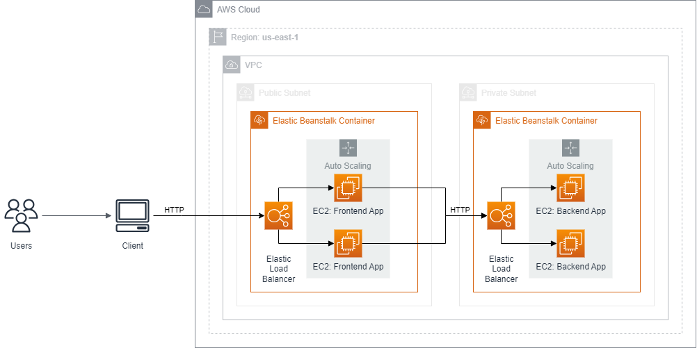

### Elastic Container Service (Fargate)

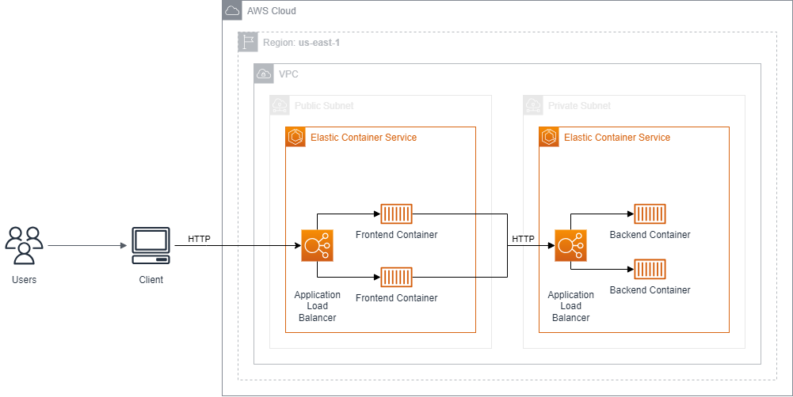

## Preview

Screenshots of configured AWS services and screenshots of running application.

### Elastic Beanstalk

Applications
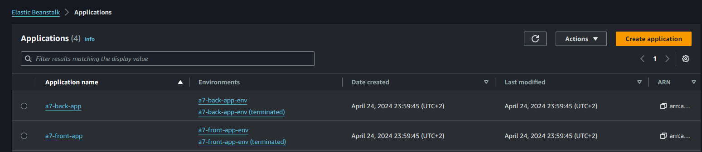

Environments
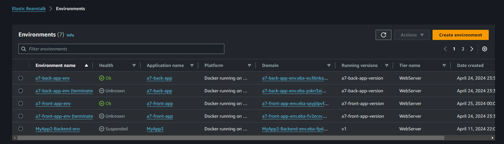

Backend Environment
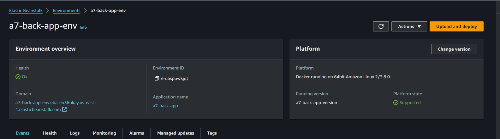

Frontend Environment
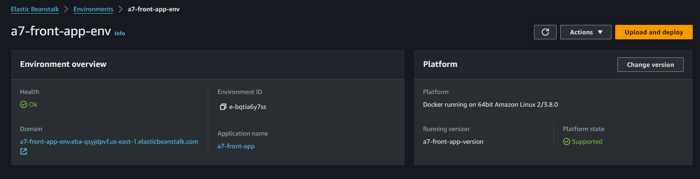

Instances
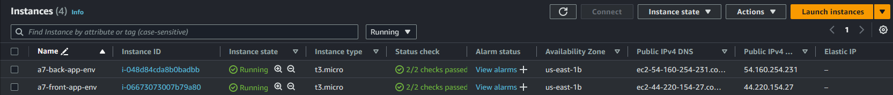

Working Application
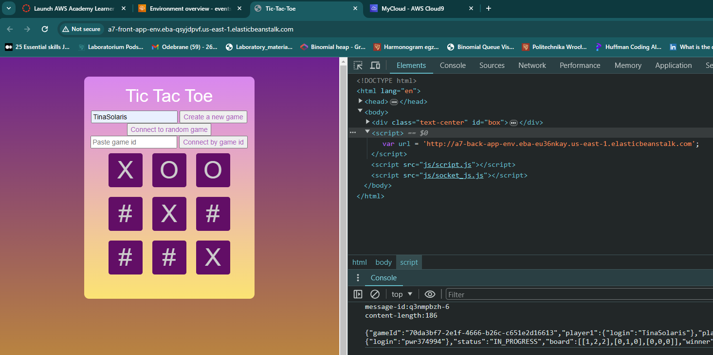

### Elastic Container Service (Fargate)

Cluster
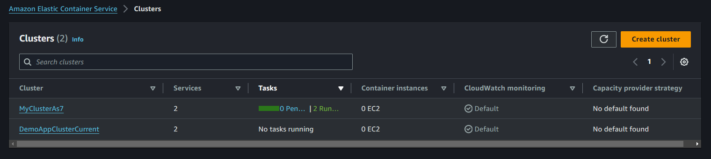

Cluster Details
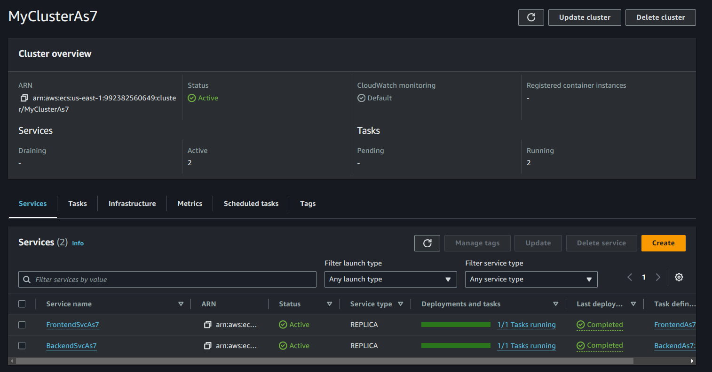

Backend Service
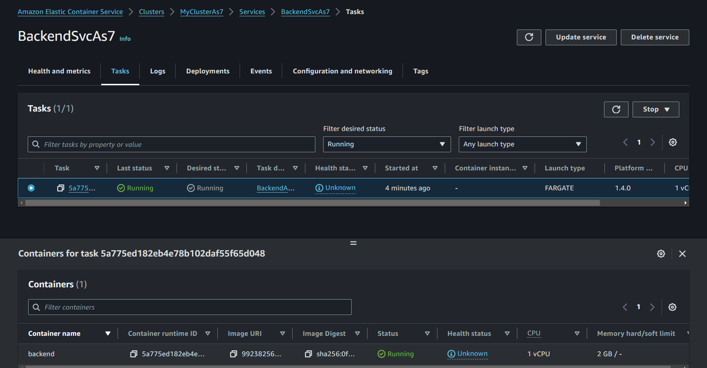

Backend Task
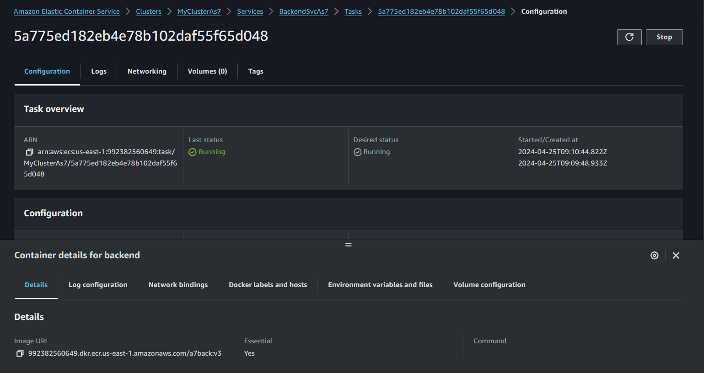

Backend Service
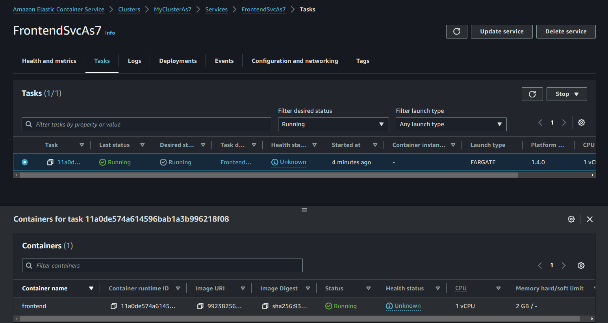

Frontend Task
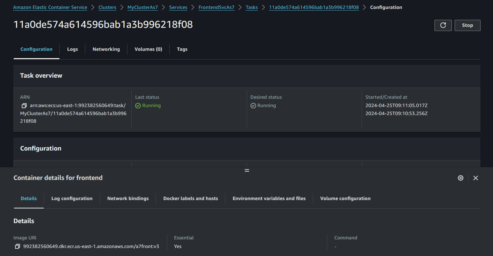

Working Application
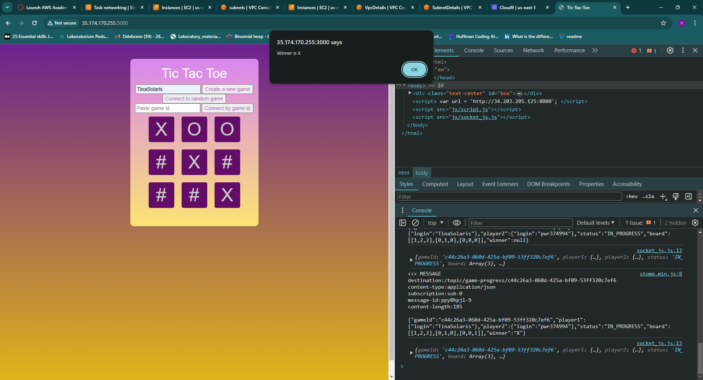
